<h1 align="center">
  
</h1>

  
  
  

---

### 👨‍💻 About Me

> Backend engineer focused on **high-throughput systems**, **distributed services**, and **blockchain infrastructure**.

- 🏢 &nbsp; Building backend services across **Crypto Exchange · iGaming · DeFi**
- 🧰 &nbsp; Daily driver: **Go** — also fluent with **Python** & **Solidity**
- 🌏 &nbsp; Based in **Taiwan** (UTC+8)
- 🎯 &nbsp; Currently exploring **microservices**, **gRPC**, and **smart contracts**
- 📫 &nbsp; Reach me via the channels below

---

### 🛠️ Tech Stack

  <strong>Languages</strong> 
  
  
  
  
  

  <strong>Frameworks &amp; Tools</strong> 
  
  
  
  
  

  <strong>Databases &amp; Messaging</strong> 
  
  
  
  
  

  <strong>DevOps &amp; Cloud</strong> 
  
  
  
  
  
  

  <strong>Blockchain</strong> 
  
  
  

---

### 🏆 Achievements

  

---

### 📅 Daily Commits

  

  

---

### 📌 Featured Projects

<table align="center">
  <thead>
    <tr>
      <th align="left">Project</th>
      <th align="left">Description</th>
      <th align="center">Tech</th>
    </tr>
  </thead>
  <tbody>
    <tr>
      <td><a href="https://github.com/riceChuang/gamerobot"><b>🎰 gamerobot</b></a></td>
      <td>Slot game robot engine for automated game testing &amp; simulation</td>
      <td align="center"></td>
    </tr>
    <tr>
      <td><a href="https://github.com/riceChuang/gorm-adapter"><b>🔐 gorm-adapter</b></a></td>
      <td>GORM adapter for Casbin — RBAC / ACL access control</td>
      <td align="center"></td>
    </tr>
    <tr>
      <td><a href="https://github.com/riceChuang/telegram-bot"><b>🤖 telegram-bot</b></a></td>
      <td>Telegram bot framework written in Go</td>
      <td align="center"></td>
    </tr>
    <tr>
      <td><a href="https://github.com/riceChuang/jbtkLineBot"><b>💬 jbtkLineBot</b></a></td>
      <td>LINE messaging bot integration</td>
      <td align="center"></td>
    </tr>
    <tr>
      <td><a href="https://github.com/riceChuang/wokerpool"><b>⚡ workerpool</b></a></td>
      <td>Lightweight goroutine worker pool implementation</td>
      <td align="center"></td>
    </tr>
    <tr>
      <td><a href="https://github.com/riceChuang/resume-matcher"><b>📄 resume-matcher</b></a></td>
      <td>Resume / job-description matching service</td>
      <td align="center"></td>
    </tr>
  </tbody>
</table>

---

### 📫 Connect with Me

  
  
  

  <i>"Talk is cheap. Show me the code." — Linus Torvalds</i>

  

